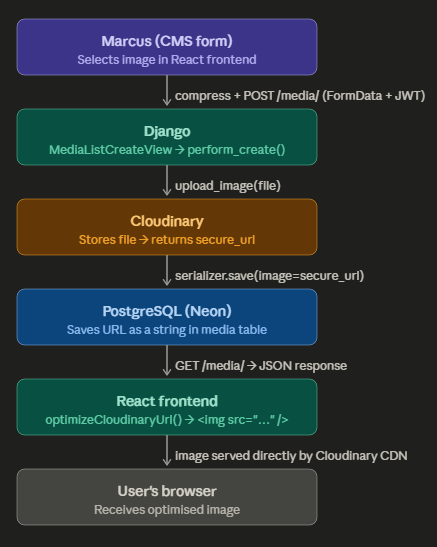

# Project Walkthrough - Marcus Swietlicki Portfolio Backend

This is the backend for my brother Marcus's professional portfolio website.

He needed a site he could manage himself with a custom admin panel so he could update his upcoming performances, biography, and media gallery, without touching code. I built a REST API in Django to serve all of that to a separate React frontend.

## What the Project Is

The backend is a Django project with five dedicated apps, each handling a different part of the site:

```
back_end_marcus/
├── bio/        # Biography text and CV link
├── events/     # Upcoming and past performances
├── media/      # Photos and YouTube videos, grouped by Production
├── contact/    # Contact form - saves to DB and sends email
├── users/      # JWT authentication
└── utils/      # Cloudinary upload helper
```

**Stack:**

- Python · Django · Django REST Framework
- PostgreSQL
- JWT (SimpleJWT)
- Cloudinary
- SMTP (hosted email)
- Heroku + Whitenoise
- React (separate frontend repo)

Planning was done upfront with a **Trello board** and **wireframes** before any code was written.

## The Image Pipline

### Step 1 - Marcus selects an image in the CMS (Frontend)

Marcus opens the Upload Media form in the React CMS. He picks a file from his computer.

Before it even leaves the browser, the image is **compressed** using `browser-image-compression`:

```jsx
// MediaForm.jsx - handleChange
const options = {
    maxSizeMB: 9,
    maxWidthOrHeight: 4096,
    useWebWorker: true
}

const compressed = await Promise.all(
    fileArray.map(file => imageCompression(file, options))
)
```

This reduces file size before upload which is better for performance, and means less data going over the network.

### Step 2 - The frontend sends the image to the backend

When Marcus hits submit, `handleSubmit` builds a `FormData` object for each image and fires a `POST` request to the Django API:

```jsx
// MediaForm.jsx - handleSubmit
for (const img of formData.images) {
    const imgData = new FormData()
    imgData.append("image", img)
    imgData.append("category", formData.category)
    if (formData.category === 'production' && formData.production) {
        imgData.append("production", formData.production)
    }
    promises.push(createMedia(imgData))
}

await Promise.all(promises)
```

Multiple images are uploaded in parallel using `Promise.all`, they all fire at once rather than one at a time.

The actual API call is in a services file:

```js
// services/media.js — createMedia
export const createMedia = async (formData) => {
    const response = await axios.postForm(`${BASE_URL}/media/`, formData, authHeaders())
    return response
}
```

`authHeaders()` attaches the JWT token, without it, Django rejects the request.

### Step 3 - Django receives the request and sends the image to Cloudinary

On the backend, `MediaListCreateView` handles the `POST`. It calls `perform_create()`:

```python
# media/views.py
def perform_create(self, serializer):
    image_file = self.request.FILES.get('image')
    image_url = upload_image(image_file)
    serializer.save(owner=self.request.user, image=image_url)
```

`upload_image()` lives in `utils/` and is a wrapper around Cloudinary's Python SDK:

```python
# utils/cloudinary.py
import cloudinary.uploader

def upload_image(image_file):
    result = cloudinary.uploader.upload(image_file)
    return result['secure_url']
```

The image is sent to Cloudinary, which stores it and hands back a secure HTTPS URL. That URL is what gets saved, the actual file never sits on the Django server.

### Step 4 - The URL is saved to PostgreSQL (Neon Console)

`serializer.save()` writes a new row to the `media` table:

```
id | owner_id | image                                    | category   | production_id
---+----------+------------------------------------------+------------+--------------
7  | 1        | https://res.cloudinary.com/.../photo.jpg | production | 3
```

The `image` field is just a `CharField` - a plain string. The database stores the reference, not the file.

### Step 5 - The frontend fetches and displays it

When a visitor opens the gallery, the frontend calls `GET /media/`. Django returns JSON:

```json
{
  "id": 7,
  "image": "https://res.cloudinary.com/.../photo.jpg",
  "category": "production",
  "production": { "name": "La Traviata", "year": 2023 }
}
```

Before the URL is used in an  tag, a utility function adds instructions to it that tell Cloudinary to automatically optimise the image quality and format for the user's browser.

```js
// utils/cloudinary.js
export function optimizeCloudinaryUrl(url, { width, quality = 'auto', format = 'auto' } = {}) {
  if (!url || !url.includes('res.cloudinary.com')) return url

  const widthParam = width ? `w_${width},` : ''
  return url.replace('/upload/', `/upload/${widthParam}q_${quality},f_${format}/`)
}
```

## Full Pipeline

